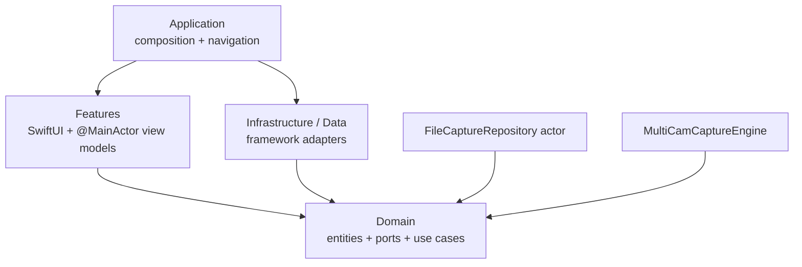
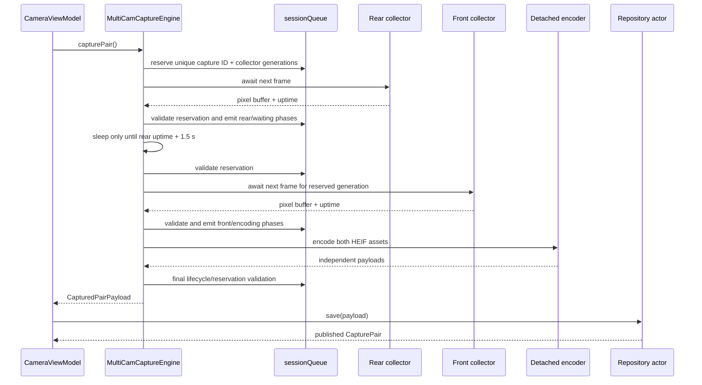
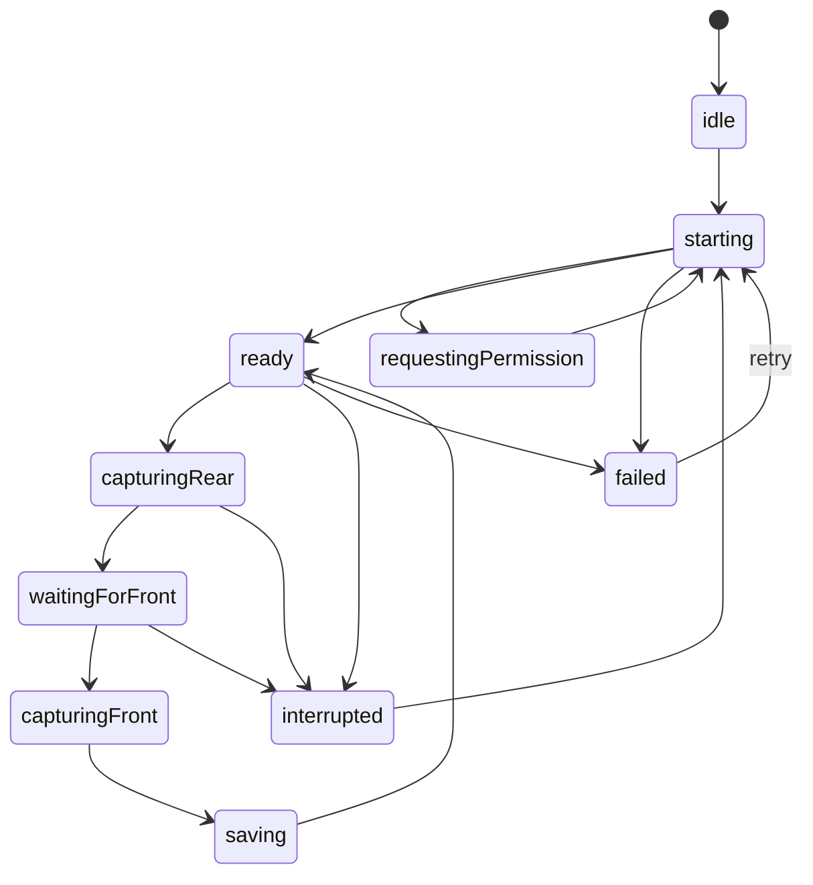

# Dual Camera Capture — Implementation Guide

## 1. Scope and current confidence

This document explains how the application is structured, how a paired capture moves through the system, and why the main technical choices were made.

The software architecture, navigation, state handling, atomic persistence, simulator UI, strict-concurrency build, and automated test build are implemented. The camera topology is also implemented against the iOS SDK, but camera-specific quality claims are deliberately provisional until a supported physical iPhone is connected. In particular, sharpness, the measured rear-to-front interval, pressure behavior, and sustained memory use need hardware evidence.

The shorter [README](README.md) is the reviewer entry point. [IMPLEMENTATION_PLAN](IMPLEMENTATION_PLAN.md) is the living requirements/status record. This guide is the deeper engineering reference.

## 2. Product flow

The application has two top-level tabs and one typed detail route.

```mermaid
flowchart LR
    Launch["Launch"] --> Camera["Camera tab"]
    Camera -->|"permission and capability pass"| Ready["Dual live preview"]
    Ready -->|"shutter"| Rear["Rear frame"]
    Rear -->|"monotonic 1.5 s target"| Front["Front frame"]
    Front --> Encode["Off-main HEIF encoding"]
    Encode --> Persist["Atomic pair persistence"]
    Persist --> Detail["Moments tab + saved detail"]
    Detail --> Feed["Moments grid"]
    Feed -->|"select tile"| Detail
```



On a simulator, the same UI and navigation remain reviewable, but the camera stage explains that MultiCam capture requires a physical device. There is no fake camera success path in production composition.

## 3. Requirement-to-implementation map

| Requirement | Implementation | Verification |
| --- | --- | --- |
| iOS 17+ and SwiftUI | iOS 17 deployment target; SwiftUI and Observation presentation | Generic simulator and device SDK builds |
| Swift Concurrency | Async camera/repository boundaries, actors, task cancellation, detached encoding/downsampling | Complete strict-concurrency build |
| Clean Architecture | Domain protocols and entities; infrastructure/data adapters; feature view models; app composition root | Dependency audit described below |
| One MultiCam session | One `AVCaptureMultiCamSession` owned by `MultiCamCaptureEngine` | SDK build; physical validation pending |
| Simultaneous previews | Explicit preview connections from the rear and front input ports | Physical validation pending |
| Rear then front after 1.5 s | First rear frame, monotonic deadline, then first front frame at/after the deadline | Timing-policy unit tests; hardware measurement pending |
| Separate assets | Independent rear/front HEIF payloads and files | Repository tests |
| Grid and detail | Adaptive Moments grid and typed detail route with primary-image swap | Simulator UI and coordinator tests |
| Local persistence | Staging directory followed by one atomic directory move | Repository tests |
| Unsupported/error states | Capability, authorization, interruption, runtime error, and pressure events mapped to explicit UI states | View-model tests plus device scenarios pending |

## 4. Architecture

### 4.1 Dependency direction

The project uses a pragmatic Clean Architecture split. The central rule is that business models and ports do not import SwiftUI, UIKit, AVFoundation, or file-system implementation details.



Dependencies point inward toward Domain. `AppContainer` is the composition root that binds the domain ports to concrete adapters:

- `CaptureRepository` → `FileCaptureRepository`
- `CameraCaptureClient` → `MultiCamCaptureEngine`
- `CameraPreviewSource` → the same `MultiCamCaptureEngine`

The in-memory and unavailable adapters are used by previews and tests without changing feature code.

### 4.2 Layer responsibilities

| Layer | Owns | Does not own |
| --- | --- | --- |
| Application | Dependency composition, selected tab, typed route path, cross-feature refresh signal, generic progress/error facility | Camera or persistence rules |
| Domain | Capture entities, camera states/errors, timing policy, repository/camera ports, small use cases | Apple UI/camera frameworks or storage layout |
| Features | SwiftUI rendering, interaction, `@MainActor` state machines | Session mutation, file I/O, image encoding |
| Infrastructure | AVFoundation session, frame collection/encoding, preview bridge, ImageIO thumbnail service | Feature navigation or product state |
| Data | File and in-memory repository implementations | SwiftUI, UIKit, AVFoundation |
| Design System | Colors, materials, cards, status presentation | Business behavior |

`ThumbnailProvider` lives under Infrastructure/Imaging rather than Data because it is a display optimization that produces UIKit images; it is not part of the persistence model. The feature may use this concrete display helper without contaminating Domain with `UIImage`.

### 4.3 Why use cases are intentionally small

The use cases currently delegate to narrow repository operations and add only behavior that belongs in the domain boundary, such as feed ordering. This is intentional. Artificial abstractions would add ceremony without creating another policy boundary. They still provide stable seams for testing and future behavior such as filtering, pagination, or retention.

## 5. Camera engine

### 5.1 Session configuration

`MultiCamCaptureEngine` creates one `AVCaptureMultiCamSession` and owns all of its mutable configuration on a dedicated serial `sessionQueue`.

Startup performs the following work:

1. Check `AVCaptureMultiCamSession.isMultiCamSupported`.
2. Discover device sets through `supportedMultiCamDeviceSets`.
3. Rank pairs, favoring a rear wide camera and a front wide/TrueDepth camera.
4. Select only formats whose `isMultiCamSupported` flag is true, preferring binned formats at up to 1920 pixels wide that sustain 30 fps.
5. Configure continuous autofocus, auto exposure, auto white balance, subject-area monitoring, and smooth autofocus where available.
6. Validate and add both inputs without automatic connections.
7. Add one video-data output and one preview connection for each input port.
8. Mirror only the front connection and use the portrait rotation angle.
9. Reduce both streams to 20 fps if the initial hardware cost is high; fail clearly if `hardwareCost` still exceeds the supported budget.
10. Install interruption, lifecycle, runtime-error, and pressure observers before running.

The first implementation is portrait-only. This is reflected in the target orientation settings and avoids presenting or saving incorrectly rotated frames while the engine uses a fixed portrait connection angle. Supporting rotation later requires updating all four connections together on the session queue and validating each saved asset on device.

### 5.2 Why video-buffer extraction was selected

The provisional still topology keeps rear and front streams continuously warm using two `AVCaptureVideoDataOutput` instances. The shutter consumes frames already flowing from the configured device pair.

Benefits:

- no session reconnection between rear and front;
- deterministic monotonic scheduling;
- no preview teardown for the second image;
- independent timestamps and payloads;
- the same topology works with pressure-driven frame-rate reduction.

Trade-offs:

- output resolution is the selected video format rather than the sensor's maximum photo resolution;
- photo-specific processing is not available;
- the first frame after the target can be up to roughly one source-frame interval late;
- motion sharpness depends on exposure duration and real lighting, so it cannot be certified in the simulator.

An alternative is still-photo output routing. That path should only replace the current implementation if physical-device comparison shows a meaningful sharpness advantage without harming immediate rear capture, timing, or preview stability. The camera protocol isolates that decision from the rest of the app.

### 5.3 Paired-capture algorithm



The deadline uses `DispatchTime.uptimeNanoseconds`. Wall-clock changes cannot alter the delay. Work completed after the rear frame is subtracted from the remaining delay, so encoding or UI animation never shifts the front target.

The UI's progress ring is intentionally presentation-only. Capture timing is owned by the engine and cannot depend on frame rendering or a main-actor timer.

### 5.4 Cancellation safety

Lifecycle cancellation has two identities:

- a unique active capture UUID prevents a stale task from being mistaken for a newer capture;
- each frame collector has a cancellation generation. A waiter created after `cancelAll()` with an old reservation is rejected immediately, closing the race where backgrounding occurs just before the front waiter is registered.

Every phase is validated on `sessionQueue`. Stop, background, interruption, runtime error, and pressure shutdown clear the reservation and cancel both collectors. A final validation after HEIF encoding prevents a completed-but-obsolete pair from reaching persistence. `CancellationError` returns the view model to a neutral state and is not shown as a user failure.

## 6. Concurrency and actor isolation

The target uses Main Actor default isolation, Approachable Concurrency, and complete strict-concurrency checking.

### 6.1 Ownership table

| State/resource | Owner | Reason |
| --- | --- | --- |
| SwiftUI-visible state and navigation | `@MainActor` view models and `AppCoordinator` | Observation changes remain UI-safe |
| Session configuration and lifecycle flags | serial `sessionQueue` | AVFoundation blocking work stays off Main Actor and mutations are ordered |
| Rear/front pending continuations | each `VideoFrameCollector`'s `NSLock` | delegate queues and async callers can meet safely |
| Event stream continuations | `eventLock` | observers and UI subscribers use different executors |
| Persisted capture tree | `FileCaptureRepository` actor | file transactions are serialized off Main Actor |
| HEIF encoding | detached user-initiated task | CPU/GPU image work does not block UI |
| Thumbnail decoding | detached utility task | feed scrolling does not decode originals on Main Actor |
| Thumbnail cache | bounded `NSCache` | thread-safe cache with memory-pressure eviction |

### 6.2 `@unchecked Sendable` audit

Framework types such as `AVCaptureSession`, `CVPixelBuffer`, `UIImage`, and `CIContext` do not all provide useful Sendable conformances. The few unchecked wrappers are constrained as follows:

- `MultiCamCaptureEngine`: mutable session state is accessed only on `sessionQueue`; event and collector registries have their own locks.
- `VideoFrameCollector`: all continuation state is protected by one lock, while received pixel buffers become immutable capture inputs.
- `PixelBufferEncoder`: the context is used only for immutable frame-to-data conversion from detached work.
- `ThumbnailProvider`: `NSCache` is thread-safe; `UIImage` crosses the detached boundary in a private wrapper after decoding is complete.
- Preview-layer and pixel-buffer wrappers are short-lived bridges around framework objects whose mutation remains on their designated queue.

Unchecked conformance is not used as a blanket way to silence warnings. The project compiles with complete checking so new crossings remain visible.

### 6.3 View lifecycle ordering

Stopping the camera is asynchronous. `CameraViewModel` retains the stop task, chains repeated stops, and waits for the previous stop before a new prepare. This prevents a rapid tab switch from letting an older stop overtake a newer start.

Preview attachment and teardown are similarly ordered. The representable coordinator retains its attachment task, and dismantling waits for attachment before detaching the exact layer. This avoids a stale preview connection when SwiftUI rapidly reconstructs the view.

## 7. Camera presentation state machine

The camera does not use one global loading Boolean. `CameraCaptureState` distinguishes:



Only `ready` allows the shutter. This rejects repeated taps at the presentation boundary, while the engine independently rejects overlapping reservations for defense in depth.

`ProgressController` remains an application-level facility for generic operations and alert presentation. Camera capture uses its own domain-specific state because “loading” is not enough to express rear capture, the timed wait, saving, interruption, or recovery.

## 8. Navigation audit

`AppCoordinator` owns:

- the selected `AppTab`;
- a typed `[AppRoute]` navigation path;
- a feed revision used to refresh after successful persistence.

All tab changes pass through `select(_:)`, which clears stale detail routes. `AppRootView` uses a custom `Binding` rather than exposing a direct binding to `selectedTab`; this ensures native tab-bar taps obey the same rule as programmatic tab changes.

The two important paths are:

1. Feed tile → `showCapture(id:)` → push detail on the existing feed tab.
2. Successful capture → `presentSavedCapture(id:)` → increment feed revision, select Moments, replace the path with the newly saved detail.

The route contains only a UUID. Detail data is loaded through the repository instead of embedding a potentially stale model in navigation state.

## 9. Persistence

Each published pair has this layout:

```text
Application Support/Captures/<UUID>/
  rear.heic
  front.heic
  metadata.json
```

Save is a transaction:

1. create a hidden `.staging-<UUID>` directory;
2. atomically write the rear asset;
3. atomically write the front asset;
4. atomically write schema-versioned JSON metadata;
5. move the entire directory to its final UUID path;
6. publish the resulting `CapturePair` to the caller.

Any error removes staging. Startup also removes abandoned staging directories. A feed item therefore cannot point to only one image. The feed skips malformed directories so one damaged item does not make the whole collection unusable; an exact detail lookup still reports invalid metadata.

Metadata stores the pair ID and creation time plus each asset's dimensions, capture date, and monotonic timestamp. Orientation is normalized by the configured connection and ImageIO thumbnail transform rather than stored as a separate manifest field in this version.

## 10. Image loading and memory

Grid and detail views never decode a full source image merely to display a small region. `ThumbnailProvider` asks ImageIO for a transformed thumbnail sized for the rendered point size multiplied by screen scale, bounded to 240...2048 pixels.

The cache is bounded by both count and approximate decoded byte cost. HEIF data is encoded after both source frames are retained, and no pixel-buffer history is maintained. This limits the steady-state memory surface to current preview buffers, at most one in-flight pair, and cached display thumbnails.

Physical testing should still profile transient peaks because AVFoundation owns additional camera pools outside this code.

## 11. UI, motion, and accessibility

The visual hierarchy is designed for a quick reviewer walkthrough:

- full rear preview as the primary stage;
- bordered front picture-in-picture with an explicit `+1.5s` label;
- status pill and contextual support card;
- large central shutter with disabled/ready visual states;
- focused “Hold steady” progress HUD;
- adaptive paired-image grid and empty/error/loading states;
- detail view that swaps visual priority without modifying source files.

Motion is short and state-driven: support-card insertion, capture HUD appearance, front-card emphasis, shutter readiness, feed insertion, thumbnail crossfade, and detail swap. There are no endless decorative animations that consume camera-time resources. Every custom animation becomes `nil` when Reduce Motion is enabled.

Haptics are issued at shutter intent and after successful persistence. They are presentation feedback only and do not participate in camera timing.

## 12. Error and lifecycle behavior

| Event | Engine behavior | UI behavior |
| --- | --- | --- |
| Permission denied/restricted | Do not start session | Contextual support card and retry path where meaningful |
| MultiCam unsupported/no pair | Do not configure session | Honest device-capability message |
| Background | Cancel pair, stop running, retain desire to resume | Capture returns neutrally; foreground may restore ready state |
| Interruption | Cancel pair, surface reason | Paused state and disabled shutter |
| Interruption ended | Restart when still desired | Starting then ready |
| Media services reset | Cancel pair and attempt session restart | Recovered or failure state |
| Other runtime error | Cancel pair; do not claim recovery | Visible recoverable failure |
| Serious/critical pressure | Reduce both stream frame rates | Pressure state emitted; session remains usable if the system permits |
| Pressure shutdown | Cancel pair | Paused/cooling message |
| Persistence failure | Roll back staging | Capture failure card; no feed item |

## 13. Testing and verification

The automated suite covers:

- exact 1.5-second timing target and elapsed-work compensation;
- late scheduling without adding another full delay;
- successful capture persistence and returned model;
- repeated-shutter rejection while a pair is in flight;
- visible mapping for real capture failures;
- silent lifecycle cancellation with no persistence;
- tab selection clearing stale routes;
- capture-to-feed/detail routing and feed refresh;
- atomic publication of two separate files and metadata;
- abandoned staging cleanup and full-pair deletion.

Build-time verification is run for both simulator and generic device SDK destinations. The app and test target compile with complete strict-concurrency checking.

Test execution requires a healthy simulator runtime. On the current machine, CoreSimulator does not materialize the test worker or launch the test host; earlier installed runtimes also reported data-migration failures. The latest command-line attempt was interrupted after 135 seconds with no test process launched. This is an environment limitation rather than a compile failure. The suite should be run from Xcode or the command in the README once a healthy runtime is available.

## 14. Physical-device validation gate

A supported iPhone is required before calling the camera portion complete. The validation run should record device model, iOS build, selected rear/front device types and formats, and the following evidence:

1. clean-install permission flow;
2. simultaneous preview, mirroring, cropping, and portrait orientation;
3. rear-to-front delta from stored monotonic timestamps over at least ten captures;
4. daylight, indoor, lower-light, and moving-subject sharpness samples;
5. rapid repeated captures and overlap rejection;
6. background during rear wait, background during encoding, and foreground recovery;
7. an interruption or camera-service reset scenario where practical;
8. hardware cost, pressure transitions, dropped-frame behavior, and memory peaks;
9. persistence across force quit and relaunch;
10. the required screen recordings and final repository update.

If sharpness is insufficient, compare a prepared photo-output route using the same measurements. Do not change topology based on nominal resolution alone; timing, exposure latency, preview stability, and sustained pressure are part of the decision.

## 15. Key decisions

### ADR-001: Protocol boundaries, not protocol-per-type

Protocols exist for the camera and repository because those are external boundaries with multiple adapters and test doubles. Views and simple value types remain concrete. This keeps substitution useful and avoids abstraction noise.

### ADR-002: Serialized queue for AVFoundation

AVFoundation configuration and `startRunning`/`stopRunning` are blocking, stateful operations. A dedicated serial queue provides deterministic ordering without putting framework objects inside a custom Swift actor that would still need delegate-queue bridging.

### ADR-003: Video-buffer capture as the provisional topology

Warm independent streams best satisfy immediate rear capture and deterministic delay in the first vertical slice. Hardware quality evidence owns the final decision.

### ADR-004: Monotonic time is the source of truth

The target is derived from the rear frame's uptime, not the shutter tap, wall clock, animation, or an arbitrary second sleep. This directly models “rear captured, then front 1.5 seconds later.”

### ADR-005: Pair-level atomic persistence

Both assets and metadata become visible with one directory move. This makes partial pairs structurally impossible in normal operation and keeps recovery simple.

### ADR-006: Typed navigation with repository reload

Routes hold stable identifiers. The repository remains the source of truth, and native tab interaction goes through the coordinator to preserve invariants.

### ADR-007: Portrait-only first version

Restricting orientation matches the fixed camera connection rotation and polished layout. Rotation support is a coherent future feature, not an implicit partially working state.

## 16. Extension points

- Replace `MultiCamCaptureEngine` behind `CameraCaptureClient` if a photo-output topology wins device testing.
- Add delete/share actions by using the existing delete use case and source file URLs.
- Add pagination or retention policy inside feed use cases without changing storage adapters.
- Add movable/resizable picture-in-picture as presentation state only; source files remain unchanged.
- Add landscape by introducing an orientation coordinator that updates every capture and preview connection on `sessionQueue`.
- Add telemetry behind a domain-neutral diagnostics port for measured intervals, dropped frames, costs, and pressure.

## 17. Suggested reading order

1. `Application/AppContainer.swift` and `Application/AppCoordinator.swift`
2. `Domain/Protocols/CameraCaptureClient.swift` and `CaptureRepository.swift`
3. `Features/Camera/CameraViewModel.swift`
4. `Infrastructure/Camera/MultiCamCaptureEngine.swift`
5. `Infrastructure/Camera/VideoFrameCollector.swift` and `PixelBufferEncoder.swift`
6. `Data/FileCaptureRepository.swift`
7. `Features/Feed` and `Features/CaptureDetail`
8. `CameraHomeTestTests`

That order follows the same path as a real capture: composition → contract → presentation state → hardware adapter → storage → review.
